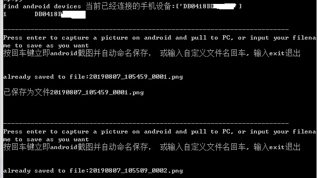
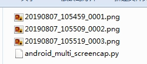

# android_multi_screencap_python
multi screencap by python when you need capture many pictures, it saves your time


android app写说明文档，或者产品经理研究竞品，都需要大量从andorid设备截图, 这个小工具可以节约你的时间,减少重复劳动!

> 解决痛点

 android multi screencap by python 
 产品经理和开发工程师经常要从android设备上大量一次性截图。
 以前的方式一般是，安装一个手机管家，或adb指令截图。但是麻烦在于，每次都要手工输入命令及给图片命名
 
# 现在有一个更优雅的方式，使用USB线连接设备后，保证有adb安装，本脚本自动帮你命名

 run time python3.5.4
 Stephen Zhu

> 环境准备

first intall python 3.5.4 or other 3.x

> 运行脚本
```
python android_multi_screencap.py
```

> 运行过程
会出现以下界面



> 截图结果

截图的结果



欢迎转发，分享，修改。如果觉得有点用，请Star。如果想标记一下以后再看，也请Star ^-^

